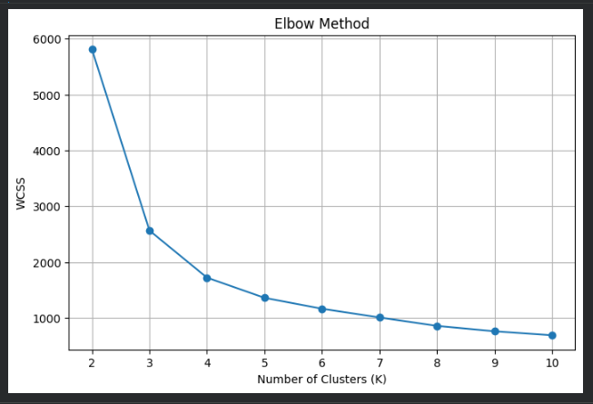
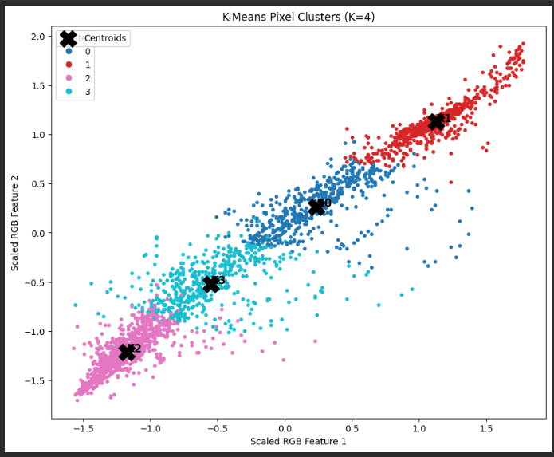
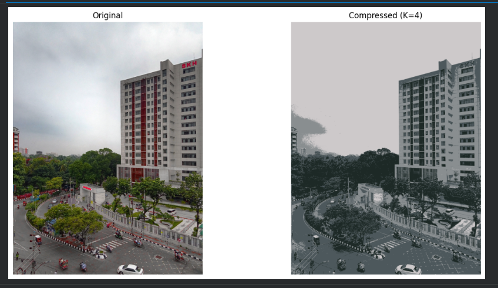
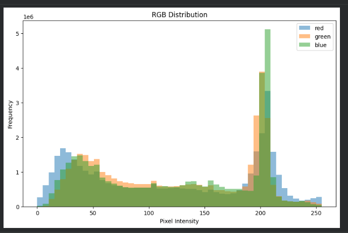

# 220105_k_means_clustering

## Cluster Description 
### Cluster 0 represents trasitional colors.
### Cluster 1 captures represents one dominant color family.
### Cluster 2 captures represents secondary or transitional tones.
### Cluster 3 represents secondary or transitional tones.
### Overall, K-Means reduced image complexity while preserving visual appearance.

## Screenshots

### Screenshot 1: Elbow Curve

### Screenshot 2: Cluster Scatter Plot

### Screenshot 3: Custom Prediction Output

### Screenshot 4: RGB Distribution

